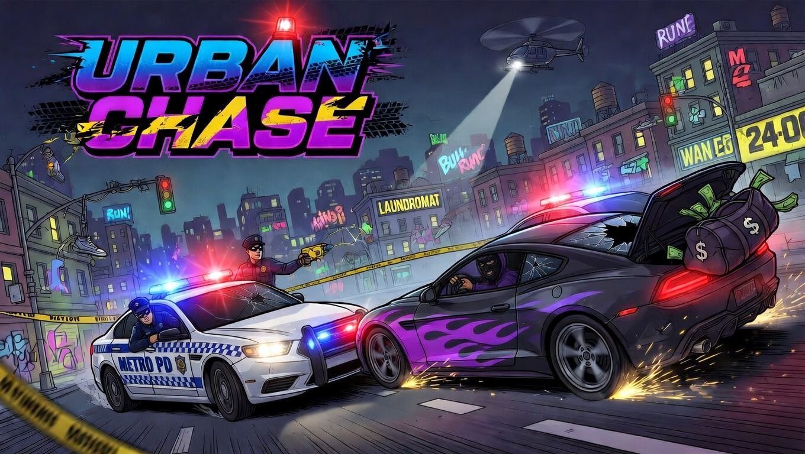

# FECAP - Fundação de Comércio Álvares Penteado

<p align="center">
<a href="https://www.fecap.br/"></a>
</p>

# 🎮 Nome do Jogo: Urban Chase

## 👥 Nome do Grupo: CADD

## 👨‍💻 Integrantes
<a href="https://www.linkedin.com/in/andre-makoto-molitorlitor-9aa6b7358">Andre Makoto Molitor</a>, <a href="https://www.linkedin.com/in/caio-fabio-ba3943392/">Caio Fabio Freitas</a>, <a href="https://www.linkedin.com/in/davivarella/">Davi Varella</a> e <a href="https://www.linkedin.com/in/davi-moraes-675642260/">Davi Moraes</a>

## 👨‍🏫 Professores Orientadores
<a href="https://www.linkedin.com/in/adriano-valente-534576135/">Adriano Felix Valente</a>, <a href="https://www.linkedin.com/in/dolemes/">David de Oliveira Lemes</a>, <a href="https://www.linkedin.com/in/eduardo-savino-gomes-77833a10/">Eduardo Savino Gomes</a>, <a href="https://www.linkedin.com/in/remuniz/">Renata Muniz do Nascimento</a>, <a href="https://www.linkedin.com/in/victorbarq/">Victor Bruno Alexander Rosetti de Quiroz</a>

---

<p align="center">

Game by <a href="https://www.linkedin.com/in/andre-makoto-molitorlitor-9aa6b7358">Andre Makoto Molitor</a>, <a href="https://www.linkedin.com/in/caio-fabio-ba3943392/">Caio Fabio Freitas</a>, <a href="https://www.linkedin.com/in/davivarella/">Davi Varella</a> e <a href="https://www.linkedin.com/in/davi-moraes-675642260/">Davi Moraes</a>
</p>

## 📖 Descrição

Este projeto consiste em um jogo de perseguição entre polícia e ladrão ambientado em um cenário urbano dinâmico. O jogador assume o papel do policial, tendo como objetivo escapar ou capturar, respectivamente, utilizando habilidades de direção e estratégia.

O diferencial do jogo está na proposta de conscientização: durante as perseguições, o jogador deve lidar com elementos do ambiente que representam o patrimônio público, como postes, bancos, hidrantes e estruturas urbanas. A destruição desses elementos impacta negativamente a pontuação, incentivando uma condução mais responsável e destacando os prejuízos causados por perseguições na vida real.

---

## 🎯 Objetivo

Criar um jogo interativo que una entretenimento e conscientização, demonstrando os impactos das perseguições urbanas no patrimônio público e na sociedade.

---

## 🧠 Mecânicas do Jogo

- Sistema de perseguição (polícia vs ladrão)
- Obstáculos urbanos interativos
- Sistema de pontuação baseado em destruição
- IA básica para viaturas policiais
- Penalizações por danos ao ambiente

---

## 🚀 Diferenciais

- Foco em conscientização social
- Cenário dinâmico com elementos destrutíveis
- Sistema de consequências (quanto mais destruição, pior o desempenho)

---

## 🛠 Estrutura de Pastas

```text
Projeto1/
├── README.md
├── imagens/
├── documentos/
│   ├── Entrega 1/
│   │   ├── Calculo I/
│   │   ├── Jogos Digitais/
│   │   ├── Logica e Algoritimos/
│   │   ├── Projeto Interdisciplinar/
│   │   └── Ética/
│   └── Entrega 2/
│       ├── Calculo I/
│       ├── Jogos Digitais/
│       ├── Logica e Algoritimos/
│       ├── Projeto Interdisciplinar/
│       └── Ética/
├── executavel/                    # PDF com link do itch.io
└── src/
    ├── Entrega 1/
    │   └── Frontend/PI_CADD/
    └── Entrega 2/
        └── Frontend/PI_CADD/
```

---

## ⚙️ Instalação

### 💻 Windows (Executável)
- Acesse a pasta `executavel/`
- Abra o PDF com o link do itch.io
- Baixe ou jogue por lá mesmo

### 📦 Código-fonte
```bash
git clone https://github.com/2026-1-MCC1/Projeto1.git
cd Projeto1
```

---

## 💻 Configuração para Desenvolvimento

Ferramentas necessárias:
- Unity Hub
- Unity Editor 6000.3.6f1

Passos:
1. Instale o Unity Hub
2. Instale/abra a versão Unity 6000.3.6f1
3. Abra o projeto em `src/Entrega 2/Frontend/PI_CADD`
4. Abra a cena `Assets/Scenes/Menu.unity`
5. Execute em Play Mode

---

## 🤝 Como Contribuir

1. Clone o projeto:
```bash
git clone https://github.com/2026-1-MCC1/Projeto1.git
cd Projeto1
```

2. Crie uma branch:
```bash
git checkout -b feat/nome-da-feature
```

3. Faça as alterações e teste no Unity.

4. Commit:
```bash
git add .
git commit -m "feat: descrição objetiva da alteração"
```

5. Push:
```bash
git push origin feat/nome-da-feature
```

6. Abra o Pull Request no GitHub com descrição e evidências (prints/vídeo) quando houver mudança visual.

---

## 📋 Licença

<a href="https://github.com/2026-1-MCC1/Projeto1"> Urban Chase </a> © 2026 by <a href="https://github.com/2026-1-MCC1/Projeto1"> André Makoto Molitor, Caio Fabio Freitas, Davi George Varella da Silva, Davi Moraes Muniz</a> <br> is licensed under <a href="https://creativecommons.org/licenses/by/4.0/"> Creative Commons Attribution 4.0 International</a> <br> 

## 🎓 Referências

- https://github.com/iuricode/readme-template
- https://github.com/gabrieldejesus/readme-model
- https://freesound.org/
- https://www.toptal.com/developers/gitignore
